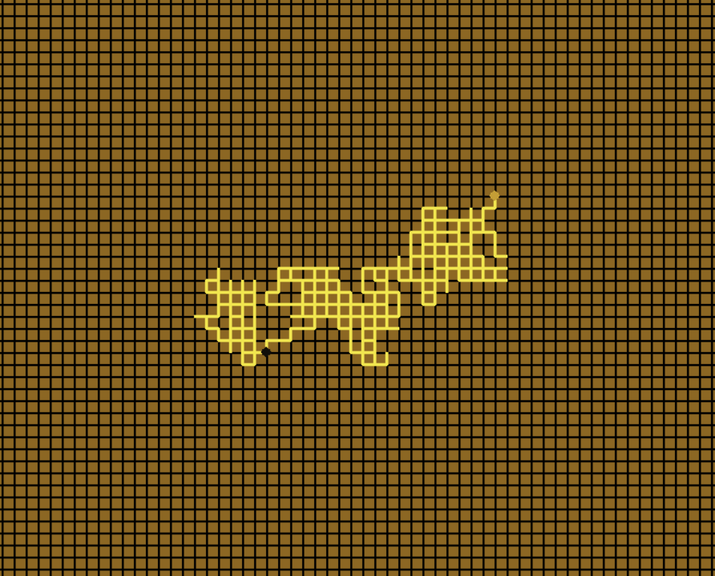
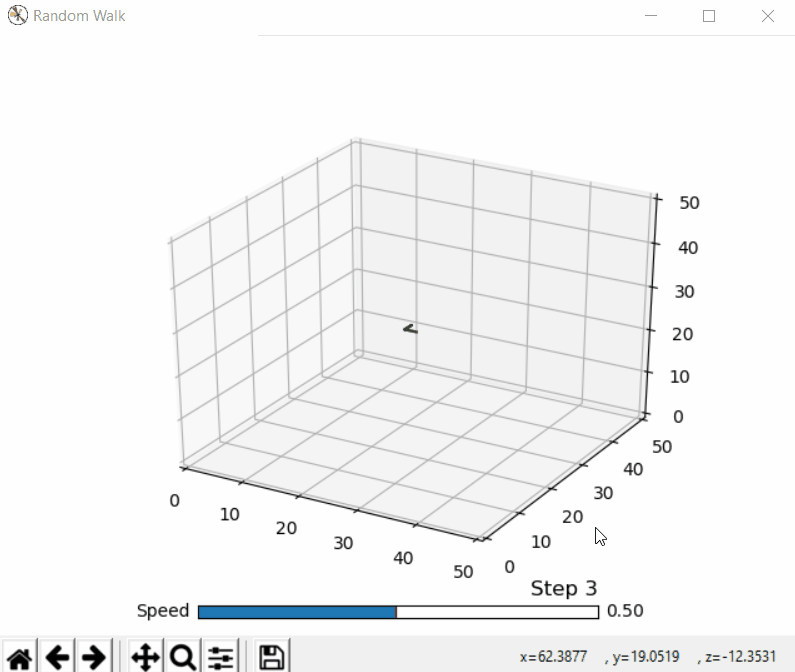

# Random-walks

Random walk is important mathematical concept with applications in many scientific fields and it can also serve as nice programming projects.

## rand_walk_1D

## rand_walk_2D

## rand_walk_3D

